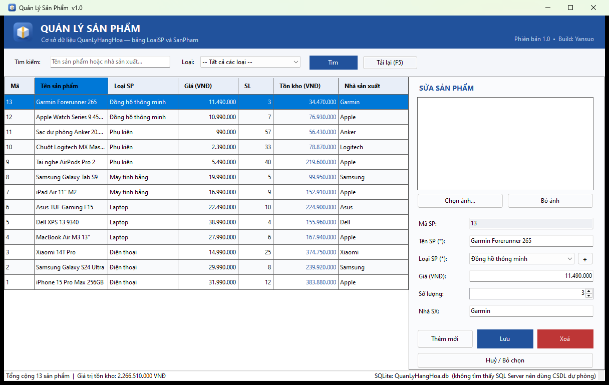

# Quản Lý Sản Phẩm

**Phiên bản 1.0** · Build: **Yansuo** · © 2026 Yansuo

<br clear="left" />

Bài tập: thiết kế cơ sở dữ liệu `QuanLyHangHoa` gồm 2 bảng `LoaiSP`, `SanPham` và xây dựng
form Windows Forms (C#) để **hiển thị – thêm – sửa – xoá** sản phẩm.



| Hạng mục | Công nghệ |
|---|---|
| Ngôn ngữ | C# 12 |
| Nền tảng | .NET 8 (Windows Forms) |
| CSDL chính | Microsoft SQL Server |
| CSDL dự phòng | SQLite (chạy được khi máy chưa cài SQL Server) |
| Truy cập dữ liệu | ADO.NET thuần (`Microsoft.Data.SqlClient` / `Microsoft.Data.Sqlite`), không dùng ORM |
| Kiến trúc | 3 lớp: `Models` – `DAL` – `Forms` |
| Đóng gói | Portable single-file, self-contained (không cần cài .NET) |

---

## 1. Yêu cầu môi trường

1. **Windows** (Windows Forms chỉ chạy trên Windows).
2. **.NET 8 SDK trở lên** – tải tại <https://dotnet.microsoft.com/download>.
   Kiểm tra: `dotnet --version`.
3. **SQL Server – không bắt buộc.** Nếu máy có thì chương trình dùng SQL Server;
   nếu không có thì tự chuyển sang SQLite để bạn vẫn chạy và chấm bài được ngay.

> Dùng Visual Studio 2022: mở `QuanLySP.sln` rồi bấm **F5**.

---

## 2. Chạy chương trình

```bash
cd D:\CodeC\QuanLySP
dotnet restore
dotnet run --project src/QuanLySP/QuanLySP.csproj
```

**Không cần tạo CSDL trước.** Khi khởi động, màn hình chờ hiện ra và chương trình:

1. Dò **song song** các instance SQL Server thông dụng
   (`(localdb)\MSSQLLocalDB`, `.\SQLEXPRESS`, `.`, `localhost`, `.\MSSQLSERVER01`, `.\SQLEXPRESS01`).
2. Nếu tìm thấy → tạo CSDL `QuanLyHangHoa`, 2 bảng và **13 sản phẩm mẫu** nếu chưa có.
3. Nếu **không** tìm thấy SQL Server nào → tự chuyển sang SQLite, tạo file
   `QuanLyHangHoa.db` ngay cạnh `QuanLySanPham.exe` với đúng cấu trúc bảng và dữ liệu mẫu đó.
4. Mở form quản lý sản phẩm. Góc phải thanh trạng thái luôn cho biết đang dùng CSDL nào.

### Bản Portable – chỉ một file `.exe`

```bash
dotnet publish src/QuanLySP/QuanLySP.csproj -c Release -p:PublishSingleFile=true -o publish
```

Kết quả: **`publish/QuanLySanPham.exe`** (~67 MB) – *một file duy nhất*, đã gói sẵn:

- toàn bộ .NET 8 runtime + Windows Forms (máy đích **không cần cài .NET**),
- thư viện `Microsoft.Data.SqlClient` và `Microsoft.Data.Sqlite` kể cả phần native,
- hai script SQL tạo CSDL và icon của phần mềm.

Chép file exe đó đi đâu cũng chạy. Lần chạy đầu nó tự tạo `QuanLyHangHoa.db`
và thư mục `Images/` **ngay cạnh file exe**, nên muốn mang cả dữ liệu sang máy khác thì
chép nguyên thư mục.

> Bản portable cố ý **không kèm** `appsettings.json` để giữ đúng một file; ứng dụng chạy
> với giá trị mặc định (`Provider = Auto`). Nếu cần cấu hình, chỉ việc tạo file
> `appsettings.json` đặt cạnh exe theo mẫu ở phần dưới.

### Chọn hệ quản trị bằng tay

Mở `src/QuanLySP/appsettings.json` (bản chạy nằm cạnh file `QuanLySanPham.exe`):

```json
{
  "ConnectionStrings": {
    "QuanLyHangHoa": ""
  },
  "Database": {
    "Provider": "Auto",
    "AutoCreate": true,
    "Name": "QuanLyHangHoa"
  }
}
```

| Khoá | Giá trị | Ý nghĩa |
|---|---|---|
| `Provider` | `Auto` *(mặc định)* | Ưu tiên SQL Server, không có thì dùng SQLite |
| | `SqlServer` | Bắt buộc SQL Server; không kết nối được thì báo lỗi, không lùi về SQLite |
| | `Sqlite` | Luôn dùng file `QuanLyHangHoa.db`, bỏ qua bước dò SQL Server (khởi động nhanh nhất) |
| `ConnectionStrings:QuanLyHangHoa` | chuỗi kết nối | Khai báo cụ thể SQL Server, ví dụ bên dưới. Để trống = tự dò |
| `AutoCreate` | `true` / `false` | Có tự tạo CSDL + dữ liệu mẫu hay không |

Ví dụ chuỗi kết nối:

```json
"QuanLyHangHoa": "Server=.\\SQLEXPRESS;Database=QuanLyHangHoa;Integrated Security=True;TrustServerCertificate=True"
```

Đăng nhập SQL Authentication:
`Server=...;Database=QuanLyHangHoa;User Id=sa;Password=***;TrustServerCertificate=True`

### Tạo CSDL bằng tay (nếu muốn)

Mở `Database/QuanLyHangHoa.sql` bằng SSMS / Azure Data Studio và bấm **Execute**.
Script viết theo kiểu *idempotent* – chạy lại nhiều lần không báo lỗi, không mất dữ liệu cũ.

---

## 3. Thiết kế cơ sở dữ liệu

### Bảng `LoaiSP`

| Cột | Kiểu | Ràng buộc | Ý nghĩa |
|---|---|---|---|
| `id` | `INT IDENTITY(1,1)` | **PK** | Khoá chính, tự tăng |
| `TenLoai` | `NVARCHAR(100)` | `NOT NULL`, `UNIQUE` | Tên loại sản phẩm |

### Bảng `SanPham`

| Cột | Kiểu | Ràng buộc | Ý nghĩa |
|---|---|---|---|
| `id` | `INT IDENTITY(1,1)` | **PK** | Khoá chính, tự tăng |
| `IdLoai` | `INT` | **FK** → `LoaiSP(id)`, `NOT NULL` | Loại của sản phẩm |
| `TenSp` | `NVARCHAR(200)` | `NOT NULL` | Tên sản phẩm |
| `Gia` | `DECIMAL(18,2)` | `NOT NULL`, `CHECK (Gia >= 0)`, mặc định `0` | Đơn giá (VNĐ) |
| `SoLuong` | `INT` | `NOT NULL`, `CHECK (SoLuong >= 0)`, mặc định `0` | Số lượng tồn |
| `HinhAnh` | `NVARCHAR(260)` | `NULL` | **Tên file ảnh** trong thư mục `Images` |
| `NhaSX` | `NVARCHAR(150)` | `NULL` | Nhà sản xuất |

Chỉ mục phụ: `IX_SanPham_IdLoai`, `IX_SanPham_TenSp` (tăng tốc lọc theo loại và tìm theo tên).

Bản SQLite (`Database/QuanLyHangHoa.Sqlite.sql`) giữ nguyên tên bảng, tên cột và mọi ràng buộc;
chỉ khác `INT IDENTITY` → `INTEGER PRIMARY KEY AUTOINCREMENT`.

### Sơ đồ quan hệ

```
┌──────────────────────┐          ┌───────────────────────────────────┐
│       LoaiSP         │          │             SanPham               │
├──────────────────────┤          ├───────────────────────────────────┤
│ PK  id       INT     │◄────┐    │ PK  id       INT                  │
│     TenLoai  NVARCHAR│     └────┤ FK  IdLoai   INT                  │
└──────────────────────┘   1 : N  │     TenSp    NVARCHAR(200)        │
                                  │     Gia      DECIMAL(18,2)        │
                                  │     SoLuong  INT                  │
                                  │     HinhAnh  NVARCHAR(260)  NULL  │
                                  │     NhaSX    NVARCHAR(150)  NULL  │
                                  └───────────────────────────────────┘
```

> **Vì sao `HinhAnh` lưu tên file chứ không lưu ảnh dạng nhị phân?**
> Lưu `VARBINARY` làm CSDL phình nhanh và truy vấn chậm. Ở đây ảnh được sao chép vào
> thư mục `Images` cạnh file `.exe`, CSDL chỉ giữ tên file → nhẹ, dễ sao lưu, dễ mang đi máy khác.

---

## 4. Cấu trúc thư mục

```
QuanLySP/
├─ QuanLySP.sln                     Solution
├─ README.md                        Tài liệu này
├─ docs/
│  ├─ screenshot.png                Ảnh chụp màn hình chương trình
│  └─ icon.png                      Icon bản 256px
├─ publish/QuanLySanPham.exe        Bản portable (sinh ra khi chạy lệnh publish)
├─ Database/
│  ├─ QuanLyHangHoa.sql             Script SQL Server (cũng được nhúng vào exe)
│  └─ QuanLyHangHoa.Sqlite.sql      Script SQLite tương đương
└─ src/QuanLySP/
   ├─ QuanLySP.csproj               Cấu hình project, metadata sản phẩm, tuỳ chọn portable
   ├─ app.ico                       Icon phần mềm (7 kích thước, 16 → 256px)
   ├─ appsettings.json              Provider + chuỗi kết nối
   ├─ Program.cs                    Điểm vào: màn hình chờ → kết nối → mở form
   ├─ Models/                       ── Tầng Model ──
   │  ├─ LoaiSP.cs                  Lớp ánh xạ bảng LoaiSP
   │  └─ SanPham.cs                 Lớp ánh xạ bảng SanPham (+ TenLoai, ThanhTien để hiển thị)
   ├─ DAL/                          ── Tầng truy cập dữ liệu ──
   │  ├─ AppSettings.cs             Đọc appsettings.json
   │  ├─ Db.cs                      Chọn/dò hệ quản trị, giữ chuỗi kết nối, mở DbConnection
   │  ├─ DbExtensions.cs            Hàm mở rộng TaoLenh / ThemThamSo dùng chung 2 provider
   │  ├─ DatabaseInitializer.cs     Tự tạo CSDL từ script nhúng (cả SQL Server lẫn SQLite)
   │  ├─ LoaiSPRepository.cs        GetAll / Insert / Exists
   │  └─ SanPhamRepository.cs       GetAll (lọc) / GetById / Insert / Update / Delete
   ├─ Helpers/
   │  ├─ ImageStore.cs              Sao chép, phân giải và nạp ảnh sản phẩm
   │  └─ ThongTinUngDung.cs         Tên / phiên bản / tác giả / icon, đọc từ metadata assembly
   └─ Forms/                        ── Tầng giao diện ──
      ├─ FrmQuanLySanPham.cs        Xử lý nghiệp vụ của form chính
      ├─ FrmQuanLySanPham.Designer.cs   Bố cục controls
      ├─ FrmDangKetNoi.cs           Màn hình chờ lúc kết nối CSDL
      └─ FrmThemLoai.cs             Hộp thoại thêm nhanh loại sản phẩm
```

---

## 5. Cách sử dụng

### Hiển thị
Danh sách nạp tự động khi mở form, sắp xếp mã giảm dần (sản phẩm mới nhất lên đầu),
dòng đầu tiên được chọn sẵn và hiển thị ở khung chi tiết bên phải.
Thanh trạng thái hiển thị tổng số sản phẩm và tổng giá trị tồn kho (`Giá × Số lượng`).

### Tìm kiếm / lọc
- Gõ từ khoá rồi **Enter** hoặc bấm **Tìm** – tìm theo *tên sản phẩm* hoặc *nhà sản xuất*.
- Chọn loại trong combo **Loại** để lọc theo loại.
- **Tải lại (F5)** xoá mọi bộ lọc và nạp lại từ CSDL.

### Thêm
1. Bấm **Thêm mới** → khung bên phải được làm trống, con trỏ nhảy vào *Tên SP*.
2. Nhập Tên SP, chọn Loại, nhập Giá / Số lượng / Nhà SX, chọn ảnh nếu có.
3. Bấm **Thêm**. Sản phẩm mới xuất hiện trên lưới và được chọn sẵn.

### Sửa
1. Bấm chọn một dòng trên lưới → dữ liệu đổ sang khung bên phải, tiêu đề đổi thành *SỬA SẢN PHẨM*.
2. Chỉnh sửa rồi bấm **Lưu**.

### Xoá
1. Chọn dòng cần xoá trên lưới.
2. Bấm **Xoá** (hoặc phím **Delete** khi lưới đang có focus) → xác nhận **Yes**.

### Thêm loại sản phẩm
Bấm nút **`+`** cạnh combo *Loại SP*, nhập tên loại mới. Loại vừa thêm được chọn sẵn.

### Phím tắt

| Phím | Chức năng |
|---|---|
| `F5` | Tải lại toàn bộ danh sách |
| `Esc` | Huỷ thao tác, bỏ chọn |
| `Delete` | Xoá sản phẩm đang chọn (khi lưới có focus) |
| `Enter` (trong ô tìm kiếm) | Thực hiện tìm kiếm |

---

## 6. Ghi chú kỹ thuật

### Chống SQL Injection
**Mọi** câu lệnh đều dùng tham số hoá, không ghép chuỗi giá trị người dùng:

```csharp
using var command = connection
    .TaoLenh("SELECT ... WHERE LOWER(sp.TenSp) LIKE @Keyword")
    .ThemThamSo("@Keyword", $"%{keyword.ToLowerInvariant()}%");
```

### Một tầng DAL, hai hệ quản trị
Repository làm việc với `DbConnection` / `DbCommand` (lớp trừu tượng của ADO.NET) nên
cùng một đoạn code chạy được trên cả SQL Server lẫn SQLite. Câu lệnh viết theo phần
cú pháp chung của hai hệ (`COALESCE` thay cho `ISNULL`/`IFNULL`, bỏ tiền tố `dbo.`);
chỗ thật sự khác nhau chỉ có một – cách lấy id vừa sinh:

```csharp
var sql = Db.Loai == LoaiCsdl.SqlServer
    ? "INSERT INTO SanPham (...) OUTPUT INSERTED.id VALUES (...)"
    : "INSERT INTO SanPham (...) VALUES (...); SELECT last_insert_rowid();";
```

### Quản lý kết nối
Mỗi thao tác mở – dùng – đóng một kết nối bằng `using` (ADO.NET có sẵn connection pool,
nên đây là cách làm chuẩn, không phải giữ một kết nối mở suốt vòng đời ứng dụng).

### Dò SQL Server song song
Nếu thử lần lượt 6 instance, mỗi lần hết timeout vài giây, ứng dụng sẽ đứng im hàng
chục giây trên máy chưa cài SQL Server. Vì vậy các phép thử chạy song song
(`Task.Run` + `Task.WaitAll`) rồi mới duyệt kết quả theo thứ tự ưu tiên, và toàn bộ quá
trình diễn ra sau màn hình chờ `FrmDangKetNoi` để cửa sổ không bị "đơ".

### Kiểm tra dữ liệu nhập
| Trường | Quy tắc |
|---|---|
| Tên SP | Bắt buộc, tối đa 200 ký tự |
| Loại SP | Bắt buộc chọn |
| Giá | Chỉ nhận số, ≥ 0; chấp nhận cả `1500000` lẫn `1.500.000`; tự định dạng lại khi rời ô |
| Số lượng | `NumericUpDown`, 0 → 1.000.000 (không thể nhập âm hay chữ) |
| Nhà SX | Tuỳ chọn, tối đa 150 ký tự |

Số tiền được định dạng bằng `NumberFormatInfo` tự khai báo (`1.234.567`) nên hiển thị
giống nhau trên mọi máy, không phụ thuộc Region setting của Windows.

### Xử lý ảnh
`ImageStore.Load` đọc file vào `MemoryStream` rồi mới tạo `Image` – tránh lỗi kinh điển của
`Image.FromFile` là khoá file ảnh cho tới khi ứng dụng đóng.

### Tên, phiên bản, tác giả và icon
Khai báo một chỗ duy nhất trong `QuanLySP.csproj` (`Product`, `Company`, `Version`, `Copyright`),
`Helpers/ThongTinUngDung.cs` đọc lại qua reflection rồi gắn lên thanh tiêu đề, header và
màn hình chờ. Nhờ vậy đổi phiên bản chỉ cần sửa csproj, và Windows cũng đọc đúng thông tin
ở *Properties → Details* của file exe.

`ApplicationIcon` chỉ gắn icon cho **file exe**; muốn **cửa sổ** cũng có icon thì phải nhúng
thêm `app.ico` dạng `EmbeddedResource` rồi gán `Form.Icon` – cách này còn giữ được đủ 7 kích
thước thay vì 32px như `Icon.ExtractAssociatedIcon`.

### Vì sao Designer viết bằng tay?
File `FrmQuanLySanPham.Designer.cs` được viết thủ công (không có `.resx`) để project build
được bằng `dotnet build` trên mọi máy, kể cả khi không cài Visual Studio. Bạn vẫn có thể mở
form bằng Windows Forms Designer của Visual Studio 2022 để chỉnh sửa trực quan.

---

## 7. Xử lý sự cố

| Triệu chứng | Nguyên nhân & cách khắc phục |
|---|---|
| Thanh trạng thái ghi *"SQLite … không tìm thấy SQL Server"* | Bình thường – máy chưa cài SQL Server nên dùng CSDL dự phòng. Muốn dùng SQL Server thì cài SQL Server Express rồi mở lại chương trình. |
| Hộp thoại *"Không kết nối được cơ sở dữ liệu"* | Chỉ xảy ra khi `Provider` = `SqlServer` hoặc bạn tự khai chuỗi kết nối mà chuỗi đó sai. Kiểm tra lại tên instance bằng SSMS, hoặc đổi `Provider` về `Auto`. |
| `A network-related or instance-specific error` | Sai tên instance. Kiểm tra bằng SSMS xem tên server thực tế là gì (`.\SQLEXPRESS`, `.`, `MÁY\INSTANCE`...). |
| `The certificate chain was issued by an authority that is not trusted` | Thiếu `TrustServerCertificate=True` trong chuỗi kết nối. |
| `Login failed for user ...` | Tài khoản Windows chưa được cấp quyền. Trong SSMS: *Security → Logins*, thêm user và cấp role `dbcreator` (hoặc dùng SQL Authentication). |
| Khởi động chậm vài giây | Đang dò SQL Server. Đặt `"Provider": "Sqlite"` để bỏ qua bước này. |
| Tiếng Việt hiển thị thành `?????` | Cột phải là `NVARCHAR` và chuỗi phải có tiền tố `N'...'` – script kèm theo đã làm đúng; lỗi này chỉ xảy ra nếu bạn tự sửa sang `VARCHAR`. |
| Ảnh không hiện lại sau khi copy sang máy khác | Nhớ chép cả thư mục `Images` nằm cạnh `QuanLySanPham.exe`. |
| Muốn xoá sạch dữ liệu để chạy lại từ đầu | SQLite: xoá file `QuanLyHangHoa.db` cạnh exe. SQL Server: `DROP DATABASE QuanLyHangHoa`. |
| Xoá loại sản phẩm báo lỗi khoá ngoại | Đúng như thiết kế: phải xoá hết sản phẩm thuộc loại đó trước. |

---

## 8. Hướng phát triển thêm

- Phân trang khi dữ liệu lớn (`OFFSET ... FETCH NEXT`).
- Xuất báo cáo Excel / PDF.
- Màn hình quản lý `LoaiSP` đầy đủ (hiện mới có thêm nhanh).
- Đăng nhập & phân quyền người dùng.
- Chuyển tầng DAL sang Entity Framework Core nếu cần làm việc với nhiều bảng hơn.

---

## 9. Lệnh hữu ích

```bash
# Biên dịch
dotnet build

# Chạy từ mã nguồn
dotnet run --project src/QuanLySP/QuanLySP.csproj

# Bản portable: đúng một file exe, gói sẵn .NET runtime và mọi thư viện
dotnet publish src/QuanLySP/QuanLySP.csproj -c Release -p:PublishSingleFile=true -o publish
```

Muốn bản nhẹ (~2 MB) nhưng máy đích phải cài sẵn **.NET 8 Desktop Runtime**:

```bash
dotnet publish src/QuanLySP/QuanLySP.csproj -c Release -r win-x64 --self-contained false -o publish-nhe
```
